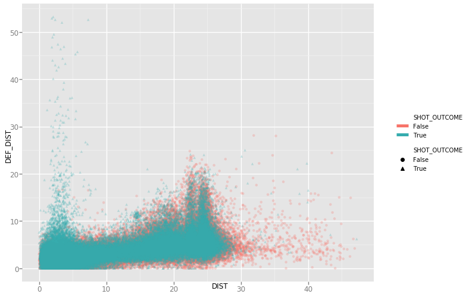
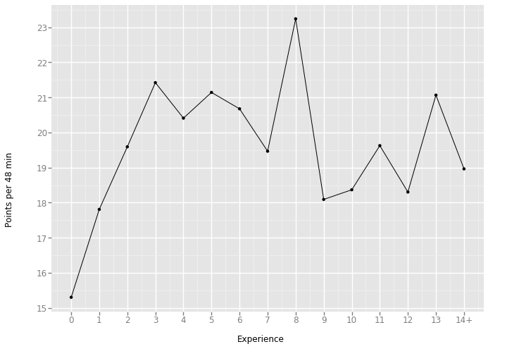
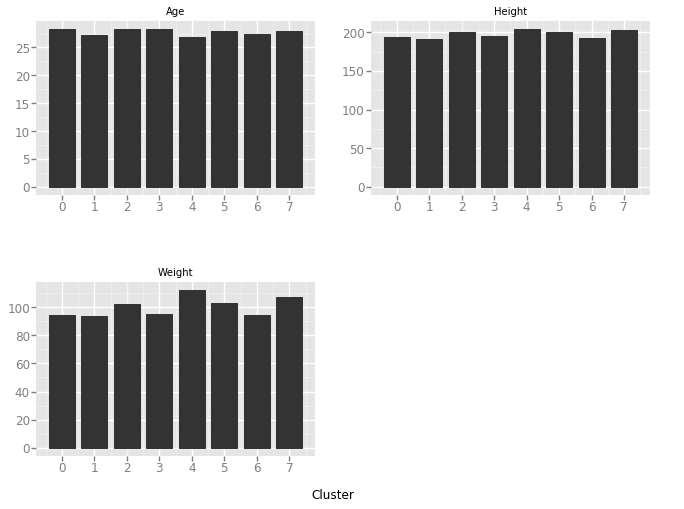
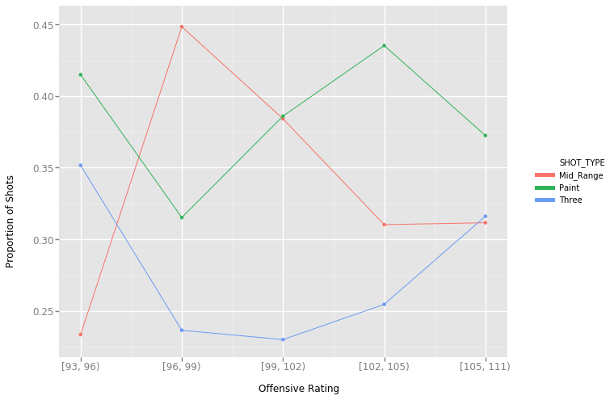

# Motivation

The use of distributed computing platforms, like Spark, are becoming more and more valuable in data analysis. To practice using Spark I decided to use it's power to analyze data that I am passionate about: the NBA. The growing popularity of analytics in basketball is evolving the game as we know it, thus making it ideal data to use for this project. Furthermore, the true insights that can be gained in the NBA are still in their infancy as the type of data available for NBA teams continues to grow and get better. 
  
In this analysis I looked at the 2014-2015 NBA Season and used data from it to implement basic machine learning models and other simple data analysis. The goal of this project was more of a practice in using PySpark than ground breaking NBA analysis. I used the University of Michigan's flux server and PySpark 1.6.

# The Data

For this analysis we used three different datasets which are described below. The three datasets will be joined together and analysis will be completed using different aspects of each.

## Shot Log
**Source:** https://www.kaggle.com/dansbecker/nba-shot-logs/data  

The first dataset that we will be using is the NBA shot log. The dataset contians 128,069 shots from 281 different players in the 2014-2015 NBA season. I understand that this is by no means a "large" dataset and the analysis on this dataset could be done in regular Python or R but once again, the goal is to learn the format and skills of PySpark. Each record is one shot in a game. We have information on which player took the shot, the shot outcome, when the shot was taken, how far away from the basket the shot was and how close the closest defender is. There is additional information on how many dribbles the player took before the shot and for how long the player was holding the ball before. This dataset gives us an almost complete picture of what was happening when the shot was taken.

##Player Information
**Source:** https://www.kaggle.com/drgilermo/nba-players-stats-20142015/data  

The next dataset that we will use is player information on 481 NBA players that played in the 2014-2015 NBA Season. For each player we have their season stat totals for the major box score statistics, including minutes, points, rebounds, field goal attempts and more. Additionally, we have personal information on the players like the players height, weight, age, college and more. Unfortunately, 68 out of the 481 players do not have this personal information. We are unsure where this missingness is coming from and so we will be cautious when using this information. The player names are unique, i.e. there are no two NBA players with the same name, which will allow us to join this data onto the shot log data through the player name. 

## Team Information
**Source:** https://stats.nba.com/teams/advanced/?sort=W&dir=-1&Season=2014-15&SeasonType=Regular%20Season

The final dataset hass information on each of the 30 NBA teams. The data was obtained from the NBA website. The basic information on NBA teams includes wins and losses, offensive and defensive ratings and other basic stats that will be used to understand the how the NBA team performed during the season. The purpose of using the team information with the player stats will be to compare how NBA teams perform, as a function of how different player's stats changed. 

# Data Manipulation Methods
In this section we will discuss any data manipulations and processing that was needed before we could start the analysis. Luckily, the data was in a fairly clean format and not much additional work was needed before we could start the analysis.

Two additional statistics were added on to the shot log data. The first is to classify the shot into which "zone" (a shot in the paint, a shot from 3 or a shot from the mid-range). Additionally, to simplify the data, we took the statistic on how many dribbles were taken before a shot and made it and indicator variable to represent whether or not the shot was off the catch or off the dribble.

The final pre-processing that was done was to bucket the team offensive rating into 5 different buckets. This will allow us to analyze similar teams (based on this rating bucket) and infer what features of these teams are making them better or worse.

# Analysis
In this section we will go over the actual analysis done for this project. There were four different tasks that were done. 

## Predicting a Shot's Outcome
The point of basketball is to score more points than the other team. To score points, you need to shoot the ball. The sport is very simple when you put it that way. What is not simple is trying to predict when a shot is going to go in or not. The model that we will fit to try and predict a shot's outcome has the distance from the basket, the distance to the closest defender, the shot type and the FG% of that player. The shot type is either a catch and shoot or a shot off the dribble. The FG% for the player is the season total for the 2014-2015 season and is the 3P% if the shot was a 3-Pointer.

Randomly splitting our data into a training (80% of our data) and a test set (20%), we predict how well our logisitic regression model classifies if a shot is made or missed. Unfortunately, the classification accuracy is a low 0.61. This shows that it is very difficult to predict if a shot is going to go on in or not as there are many other factors that go into the shot. Additionally, while shots closer to the basket are generally thought of as easier shots, your defender is also much closer to you which causes a different relationship than when you are at the 3 point line and your defender is the same distance away. Looking at the plot below we start to see the complexity of  predicting the shot's outcome as many made and missed shots are all clustered in the same area. Excuse the blurriness, the transparancy was increased to try and see more of the points.

Despite our complexities, our model does back up intuitive thinking. In the table below we see the coefficients from the logistic regression that we fit. As one would expect, as you get farther away from the basket (increase your shot distance), the odds that your shot goes in goes down. Additionally, as the defender gets farther away (increasing the defender distance), the odds your shot goes in increases. Nothing ground breaking yet. It is interesting to see that the coefficient for defender distance is larger in absolute value, showing that your odds of making a shot increases more by moving your defender one foot farther away than you as a shooter moving in one foot, keeping all other factors constant. The Shot Type factor is an indicator of whether the shot was a catch and shoot or off the dribble. It is agreed that shooting off the dribble is much hard (just try it yourself at a local park or gym) and thus it makes sense that the odds of a shot going in decreases as you go from a catch and shoot to off the dribble. 

| Variable          | Coefficient |
|------------------:|:-----------:|
| Shot Distance     | -0.0553     |
| Defender Distance | 0.1056      |
| Shot Type         | -0.1369     |
| FG%               | 0.0034      |

## Does scoring get better with experience?
Does it take a rookie a couple years to adapt to the next level? Do older players start to adapt their game by passing more? In our next analysis we looked at the relationship between player's scoring per 48 minutes and how many years they have been in the league. We took all players who played more than 250 minutes in the 2014-2015 season and grouped them by their experience level. Experience level was used over age because people can enter the league at different ages. In the table and graph below we see the results:

| Experience | n  | Points per 48 min |
|-----------:|:--:|:-----------------:|
| Rookies    |14  | 15.30             |
|1           |26  | 17.81             |
|2           |23  | 19.59             |
|3           |23  | 21.42             |
|4           |22  | 20.41             |
|5           |25  | 21.14             |
|6           |18  | 20.68             |
|7           |16  | 19.47             |
|8           |7   | 23.24             |
|9           |12  | 18.09             |
|10          |11  | 18.36             |
|11          |16  | 19.63             |
|12          |4   | 18.30             |
|13          |6   | 21.07             |
|14+         |9   | 18.96             |

Through this basic analysis our hypothesized thoughts seem to be correct. Scoring seems to increase through the first 3 years in the leagure where it reaches its height around a player's 4th year in the league (3 years of experience). After about 8 years of experience we a decline in scoring for the rest of the years with the 9 years of experience showing the third lowest points per 48 minutes. There is a spike at 13 years experience but due to the small sample size we are weary about the results.

The leaders during the 2014-2015 season were Kevin Durant, LeBron James, Kevin Love and Russell Westbrook who were in their 7th, 11th, 6th and 6th year of experience respectively and were all above 34 points per 48. The large spike at 8 years was lead by LaMarcus Aldridge's impressive 30.8 points per 48 and Rudy Gay's 27.6 points per 48. It seems that while we do see some trends in the early and very late times in players' careers, the best scorers have different experience levels. 

## What are the physical qualities of NBA "positions"?
Within the NBA analytics community it is agreed upon that using the five traditional positions does not represent today's NBA game. With stretch 4's, 3 & D wings, scoring point guards vs traditional pass first point guards, we can no longer pigeonhole players into just a point guard, shooting guard, small forward, power forward and center. As we start to look at clustering players by their qualities a question I have is: What are the physical qualities (height, weight and age) of these new and improved positions. The motivation behind this analysis came from the general positions. Point guards are smaller and the centers are bigger. Now that we focus more on the individual skills, instead of general buckets, it will be interesting to see how the idea behind player positions change. Our hypothesis is that we won't see much variation between our clusters because this turn to "position-less" basketball will group players by different skills and not by any physical atributes.

The first step was to first define our new "positions", which was done by using k-means clustering to fit players into 8 groups. Since we only have data from the 2014-2015 season and since we do not have number of possessions, we will use statistics per 48 minutes. Using season totals can be problematic because it would just lead to cluster people based on how often they play. We ended up deciding on clustering by the following statistics:

* Points per 48
* Field Goal Attempts per 48
* FGP%
* 3 Point Attempts per 48
* 3P%
* Free Throw Attempts per 48
* FT%
* Offensive Rebounds per 48
* Deffensive Rebounds per 48
* Asists per 48
* Steals per 48
* Turnoversr per 48

We filtered out any players that did not play at least 1000 minutes. This was an arbitrary cutoff but felt like it gives enough time for a player to get find an actual role in the game. That leaves us with a total of 274 players.

Below we see how our clusters split up. It was pretty difficult to identify the different clusters, not giving us too much confidence in using per 48 minute stats. Saying that, we did our best to identify the new "positions" by the players in each cluster. Looking at the clusters, we feel that we are better explaining the current state of the NBA than the traditional five positions.

| Cluster Name        | Num. Players | Example of players                             |
|--------------------:|:------------:|:----------------------------------------------:|
| Defensive Wings   | 58   | Andre Iguodala, Iman Shumpert, Patrick Patterson |
| 3 and D Wings       | 32           | Trevor Ariza, Avery Bradly, Gordon Hayward     |
| Role Players        | 45           | Al-Farouq Aminu, Otto Porter Jr., Matthew Dellavedova |
| 3 Point Wings | 32     | Chandler Parsons, Danny Green, Kyle Korver     |
| Score First Mindset         | 21           | Dwyane Wade, DeMarcus Cousins, DeMar DeRozan   |
|  Interesting Mix of Players  | 33  | Carmelo Anthony, Serge Ibaka, Tim Duncan, Tony Parker |
| All Star Guards      | 10           | LeBron James, Russell Westbrook, Stephen Curry |
| Defensive Bigs      | 43           | DeAndre Jordan, Tristan Thompson, Tyson Chandler |

The purpose of this analysis is to see how the physical attributes of these players compare. We will look at how the average age, height and weight to compare the clusters. Below we see a table and graphs of the NBA average for each attribute as well the attributes split up by each cluster. The cluster number is shown for plotting purposes.

What we can see is that there is not much noticable discrepancies between groups. For the clusters taht are composed of an "interesting mix of players", the score first mindset players and role players there is a large variety in players within the clusters. We can see some interesting insights within the age of these groups. Role Players and the big mix of players both had ages above the average age of the NBA while the score first players were the youngest cluster. Pairing the scoring the analysis that we did in the previous section with these results, we can start to infer that younger players may have more energy/more athletic and thus are more focused on scoring. Additionally, the previous analysis looked at scoring that has to do with experience. Most players enter the NBA between 19-21, so an average age of 26.8 would put these players at about 5-8 years experience. On the other side, older players start to have to find smaller roles that can come in many different forms to help out their team. Other insights we can see is that 3 point shooting is no longer for short players. Both 3 and D Wings and 3 Point focused wings are at or above the league average in height. We are starting to see bigger wings and "strech 4's" shoot more three's. It was this movement that lead people start to think that the original 5 positions needed more insight and our analysis backs up these earlier thoughts. 

| Cluster (Cluster #)      |    Average Age (Years)     | Average Height (Ft' In\")     | Average Weight (lbs)   |
|------------------:|:--------------------------:|:----------------------------:|:----------------------:|
| Entire NBA        | 27.9                       |  6' 5"                       |    221                 |
| Defensive Wings (0)  | 28.4                       |  6' 4"                       |    208                 |
| 3 and D Wings (1)     | 27.3                       |  6' 7"                       |    207                 |
| Role Players (2)      |  28.3                      |  6' 7"                       |    225                 |
| 3 Point Wings (3)     | 28.3                       |  6' 5"                       |    210                 |
| Score First Mindset (4) | 26.8                     |  6' 8"                       |    248                 |
| Interesting Mix of Players (5) | 28.0              |  6' 6"                       |    227                 |
| All Star Guards (6)   | 27.4                      |  6' 3"                       |    206                 |
| Defensive Bigs (7)   |  27.9                      |  6' 9"                       |    236                 |

# Team Offensive Rating by Proportion of Shot Types
Mid range shots are not efficient. In the 2014-2015 NBA season, mid-range shots had an expected point total of 0.802 while shots in the paint had an expected point total of 1.13 and three pointers had an expected point total of 1.06. If we know this, if NBA teams know this, then would it make sense to say that the better offensive teams shoot less mid range shots? That is the motivation behind this analysis. We used the offensive rating buckets and shot buckets (paint, mid range and three point) that we created in the data pre-processing as our keys for spark. Using these keys, we found the proportion of shots taken in each bucket. The results are shown below.

What stands out in our results? That the worst offensive rating teams actually shoot the highest proportion of three pointers. Further investigation found that the only team in the smallest bucket is the Philadelphia 76ers. The 76ers, while not the most talented on the court during the 2014-2015 season, were one of the leaders in sports analytics thanks to their GM Sam Hinkie. So while these results show the opposite of our original hypothesis- better teams shoot more threes- we can see the impact of analytics in the game. Disregarding the first bucket, we see see that the average proportion of three pointers taken increases with offensive rating and the average proportion of mid range shots decreases. This shows us that there seems to be some correlation between trading in the inefficient mid range shots for three pointers and the team's overall offensive rating.

# Conclusion
Our goal was to explore the 2014-2015 NBA season using PySpark. While we did not have a single hypothesis or question that we were trying to answer, we accomplished this goal. In each of the four tasks we were able to support what we believed to be true with empirical evidence of found suprising insights that allowed us to better understand new aspects of the NBA. Looking ahead to the current NBA season (2017-2018), we see can see how the traditional positions are continuing to disappear (Ben Simmons, 6' 10", is playing point guard, Warriors, Cavs, Celtic all starting \"small\" lineups with no traditional centers, etc.). Additionally, last season the Houston Rockets (Offensive Rating of 114.7) rewrote the record books in multiple 3 point categories, including an NBA record in most 3 point field goals attempted in a single half, game and season. Thus, the analysis that we found in this project has continued to develop in the NBA. Finally, further analysis like this one can continue to change the NBA by finding new ways to improve player positioning and offensive and defensives strategies.

